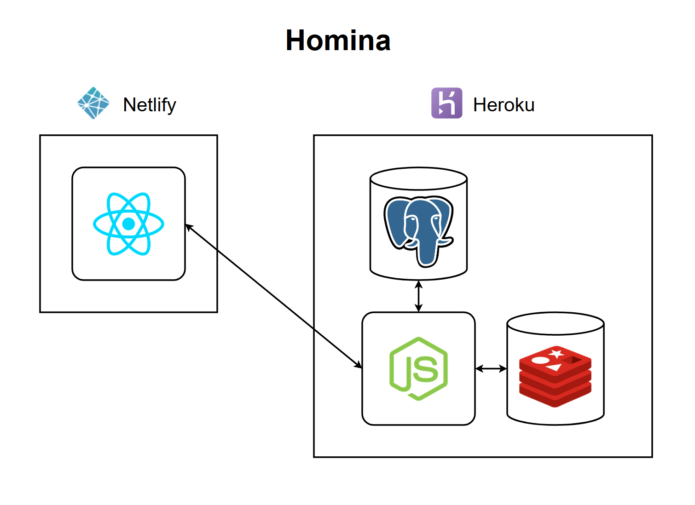

# Homina Design Document

**Author:** Roshen Nair

<!-- START doctoc generated TOC please keep comment here to allow auto update -->
<!-- DON'T EDIT THIS SECTION, INSTEAD RE-RUN doctoc TO UPDATE -->
## Table of Contents

- [Introduction](#introduction)
- [Context](#context)
- [Scope](#scope)
  - [Goals](#goals)
  - [Timeline](#timeline)
  - [Non-Goals](#non-goals)
- [User Interfaces](#user-interfaces)
- [System Architecture](#system-architecture)
  - [System Overview](#system-overview)
  - [Front End Architecture](#front-end-architecture)
  - [Server Architecture](#server-architecture)
  - [Data Storage](#data-storage)

<!-- END doctoc generated TOC please keep comment here to allow auto update -->

## Introduction

The purpose of this document is to provide an in-depth description of Homina's design and architecture in its entirety. The document first provides some context for the necessity of this system i.e. the *why* behind Homina. Next, the scope of the project is explained in terms of its primary goals, success metrics and project timeline. The user interfaces section then showcases mockups of both the web and mobile UIs while conveying the intended end-to-end user experience. Next, the document takes a deep-dive into Homina's technical architecture, explaining the various interlinking components on both the clients and the server.

## Context

The reason I started this project was to gain a deeper understanding of the process of designing, building and deploying a full-stack application from scratch. I decided to pick a simple problem to solve, contact storage, because I found that existing solutions are either subpar or require us to trust large technology corporations with our personal data. I decided that I would try to create a simple open-source solution to the problem of contact storage while building on the ideas and issues faced by existing solutions. During the design phase of this project, all feature development was centered around the user story of a hypothetical user named **David**.

As David, I want to save my contacts online, so that I can access them from any location via any Internet-connected device. I also want to back up all my smartphone contacts, so that I don't have to worry about losing any of my data. This would also make it effortless for me to migrate my contacts over to new digital devices at a moment's notice. However, I need to be sure that my data is kept secure and private so that I can rest assured that malicious individuals or organizations aren't exploiting my data for profit. I would also like to group contacts into different categories or labels, so that they can be easily found at a moment's notice. Besides that, I want to be able to update my contacts in real time, so that these updates will be reflected on all my digital devices instantly. Above all, I want contacts storage to be both intuitive and frictionless in my daily life, such that it runs in the background with minimal configuration. Any proposed solutions to this problem need to make my life easier and save me both time and effort, instead of requiring me to do any extra work.

## Scope

The overarching scope of this project entails the design, development and deployment of a cross-plarform, full-stack application that solves the problem of contacts storage. The following section includes the specific goals set out for the Homina project and also provides a timeline for the completion of each specific milestone during the lifetime of this project.

### Goals

Here are the specific goals and success metrics used to measure the Homina project's success (based on user requirements):

- Create a cross-plaform software system that allows users to store contacts online.
- Sync users' smartphone contacts and Homina contacts automatically.
- Allow users to effortlessly migrate contacts over to new devices.
- Secure all user data with session-based authentication, SSL and password hashing.
- Allow users to group contacts into different labels/categories
- Update Homina contacts instantly whenever users change/update contact information.
- Provide an intuitive, frictionless UX for users.

### Timeline

The overall Homina project is estimated to reach completion within a timespan of **3 to 4 months**. The following table breaks down the various tasks/milestones of the project along with estimated completion dates:

> **Note:** These milestones and completion dates may be updated from time to time as project goals or requirements change.

| Milestone | Estimated completion date |
| --- | --- |
| Develop Homina design language | 30 April 2021 |
| Develop UI/UX flows | 7 May 2021 |
| Design normalized data schema | 9 May 2021 |
| Implement PostgreSQL database | 14 May 2021 |
| Develop MVC-based Node.js web server | 21 May 2021 |
| Implement session-based authentication | 28 May 2021 |
| Design REST API endpoints | 1 June 2021 |
| Expose REST API on the web server | 4 June 2021 |
| Develop React front end application | 18 June 2021 |
| Extend front end for mobile functionality with React Native | 9 July 2021 |
| Deploy back end to Heroku | 11 July 2021 |
| Deploy front end to Netlify | 16 July 2021 |
| Assign custom subdomain of [roshennair.com](https://roshennair.com/) to Homina | 18 July 2021 |

### Non-Goals

As important as goals are to any project, non-goals are equally as important for setting expectations and making sure that efforts aren't wasted on unnecessary tasks. Here is a list of development goals for Homina that are either nice-to-haves or won't be actively pursued for the time being:

- Develop monetization channels.
- Develop a large customer base.
- Add multilingual functionality.
- Achieve profitability.
- Design a highly aesthetic UI.

## User Interfaces

## System Architecture

### System Overview

Homina is a cross-platform application that stores, syncs and backs up users' contacts on the cloud. It consists of a front end written in React (web) and React Native (mobile), a web server written in Node.js and Express, a Redis cache for session storage, and a PostgreSQL database for contacts storage. The back end (server and database) is hosted on Heroku while the front end (web and mobile clients) is hosted on and distributed via Netlify.

### Front End Architecture

### Server Architecture

### Data Storage