# Homina Design Document

**Author:** Roshen Nair

<!-- START doctoc generated TOC please keep comment here to allow auto update -->
<!-- DON'T EDIT THIS SECTION, INSTEAD RE-RUN doctoc TO UPDATE -->
## Table of Contents

- [Introduction](#introduction)
- [Context](#context)
- [Scope](#scope)
  - [Current Goals](#current-goals)
  - [Timeline](#timeline)
  - [Future (Potential) Goals](#future-potential-goals)
  - [Non-Goals](#non-goals)
- [Branding](#branding)
  - [Color palette](#color-palette)
  - [Logos](#logos)
  - [Typography](#typography)
- [User Interfaces](#user-interfaces)
  - [Sign Up](#sign-up)
  - [Log In](#log-in)
  - [Contacts](#contacts)
  - [Contact Details](#contact-details)
  - [Add Contact](#add-contact)
  - [Edit Contact](#edit-contact)
- [System Architecture](#system-architecture)
  - [System Overview](#system-overview)
  - [Front End Architecture](#front-end-architecture)
  - [Server Architecture](#server-architecture)
  - [Data Storage](#data-storage)

<!-- END doctoc generated TOC please keep comment here to allow auto update -->

## Introduction

The purpose of this document is to provide an in-depth description of Homina's design and architecture in its entirety. The document first provides some context for the necessity of this system i.e. the *why* behind Homina. Next, the scope of the project is explained in terms of its primary goals, success metrics and project timeline. The user interfaces section then showcases mockups of both the web and mobile UIs while conveying the intended end-to-end user experience. Next, the document takes a deep-dive into Homina's technical architecture, explaining the various interlinking components on both the clients and the server.

## Context

The reason I started this project was to gain a deeper understanding of the process of designing, building and deploying a full-stack application from scratch. I decided to pick a simple problem to solve, contact storage, because I found that existing solutions are either subpar or require us to trust large technology corporations with our personal data. I decided that I would try to create a simple open-source solution to the problem of contact storage while building on the ideas and issues faced by existing solutions. During the design phase of this project, all feature development was centered around the user story of a hypothetical user named **David**.

As David, I want to save my contacts online, so that I can access them from any location via any Internet-connected device. I also want to back up all my smartphone contacts, so that I don't have to worry about losing any of my data. This would also make it effortless for me to migrate my contacts over to new digital devices at a moment's notice. However, I need to be sure that my data is kept secure and private so that I can rest assured that malicious individuals or organizations aren't exploiting my data for profit. I would also like to group contacts into different categories or labels, so that they can be easily found at a moment's notice. Besides that, I want to be able to update my contacts in real time, so that these updates will be reflected on all my digital devices instantly. Above all, I want contacts storage to be both intuitive and frictionless in my daily life, such that it runs in the background with minimal configuration. Any proposed solutions to this problem need to make my life easier and save me both time and effort, instead of requiring me to do any extra work.

## Scope

The overarching scope of this project entails the design, development and deployment of a cross-plarform, full-stack application that solves the problem of contacts storage. The following section includes the specific goals set out for the Homina project and also provides a timeline for the completion of each specific milestone during the lifetime of this project.

### Current Goals

Here are the specific goals and success metrics used to measure the Homina project's success (based on user requirements):

- Secure all user data with session-based authentication, SSL and password hashing.
- Allows users to store, access and edit their contacts from any Internet browser i.e. web, mobile
- Allow users to group contacts into different labels/categories

### Timeline

The following table breaks down the various features/milestones of the project along with estimated completion dates:

> **Note:** These milestones and completion dates may be updated from time to time as project goals or requirements change.

| Feature/Milestone | Estimated completion date |
| --- | --- |
| Account creation | 10 May 2021 |
| Session-based authentication | 17 May 2021 |
| Adding and editing contacts | 24 May 2021 |
| Labelling contacts and filtering contacts by label | 31 May 2021 |

### Future (Potential) Goals

- Sync users' smartphone contacts and Homina contacts automatically.
- Allow users to effortlessly migrate contacts over to new devices.
- Provide an intuitive, frictionless UX for users.

### Non-Goals

As important as goals are to any project, non-goals are equally as important for setting expectations and making sure that efforts aren't wasted on unnecessary tasks. Here is a list of development goals for Homina that are either nice-to-haves or won't be actively pursued for the time being:

- Develop monetization channels.
- Develop a large customer base.
- Add multilingual functionality.
- Achieve profitability.
- Design a highly aesthetic UI.

## Branding

Before jumping head-first into the design of Homina's UI/UX flow, I spent some time conceptualizing Homina's visual branding to simulate the branding efforts of a real-world product.

### Color palette

A color palette defines the visual fingerprint of a product, so it stands to reason that Homina needs a good color palette. Here's the 6-color palette I chose for Homina (with some help from [coolors.com](https://coolors.co/))

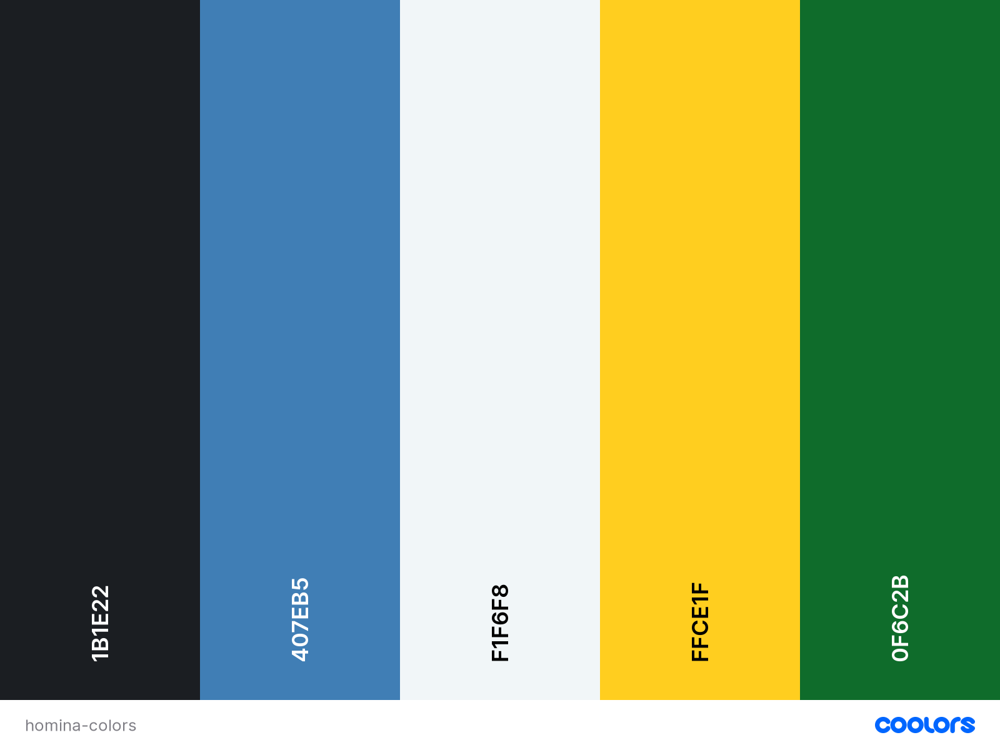

Homina color palette

### Logos

Every business/product needs a strong logo to convey its mission and brand image, and Homina is no different. Here are some images of the final design for Homina's logo: 

Darkmode and lightmode logos (without name)

 

Darkmode and lightmode logos (name)

### Typography

The named logos (displayed above) utilize the font Josefin Sans, which will be used sparingly and is regarded as off-limits for any other product copy beyond Homina's logo. The rest of the application's UI and product copy will utilize Source Sans Pro, a highly readable and flexible font.

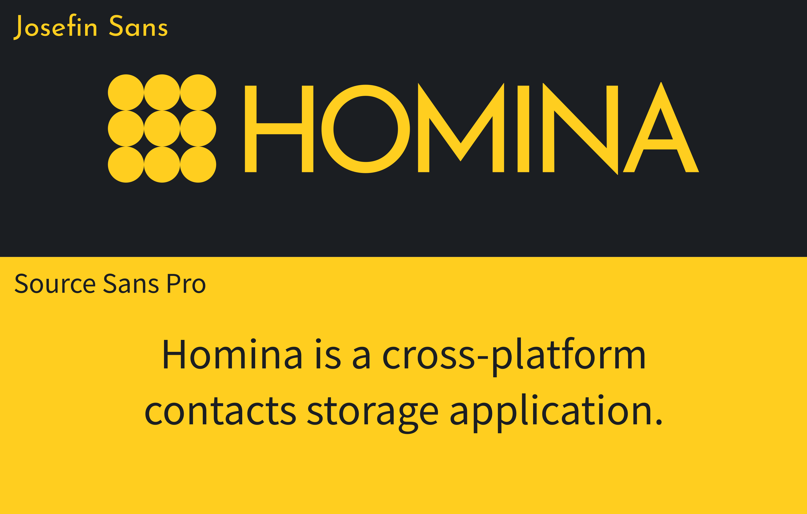

Homina typography guide

All the fonts used for the Homina project were obtained for free from [Google Fonts](https://fonts.google.com/).

## User Interfaces

The following section will showcase the final rendered UI designs for each main view in the Homina application. To reflect a responsive UI, each view features both a mobile and web view. All of the UI designs were created using [Figma](https://www.figma.com/).

### Sign Up

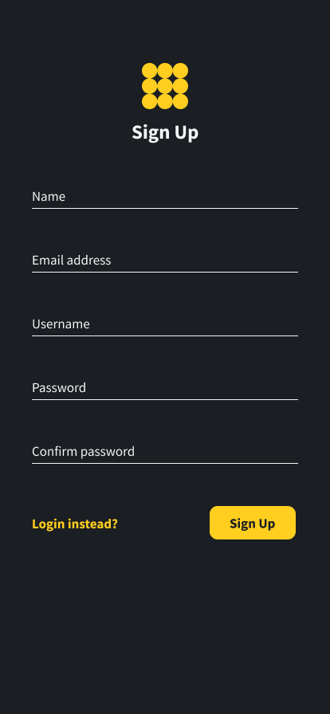

Mobile sign up UI

Web sign up

### Log In

Mobile log in UI

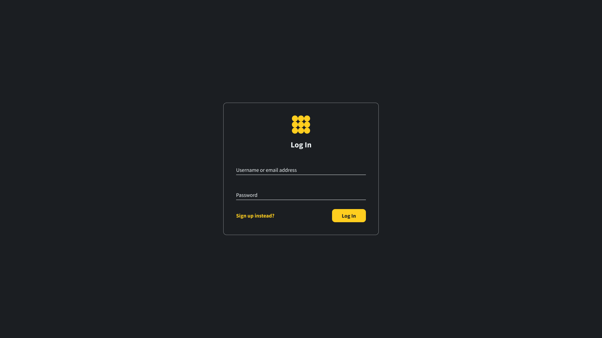

Web log in

### Contacts

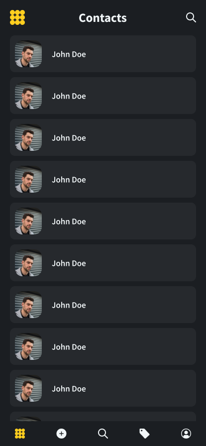

Mobile contacts UI

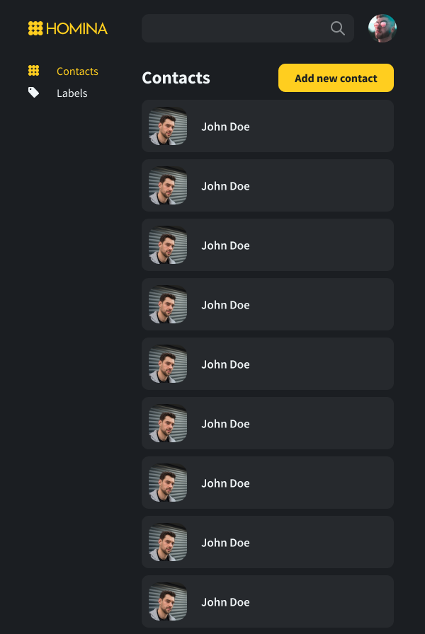

Tablet contacts UI

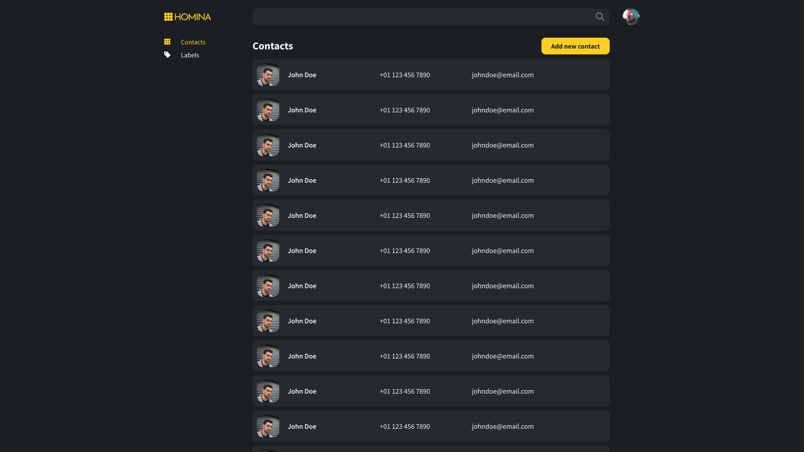

Web contacts UI

### Contact Details

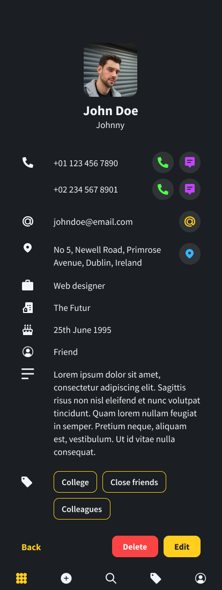

Mobile contact details UI

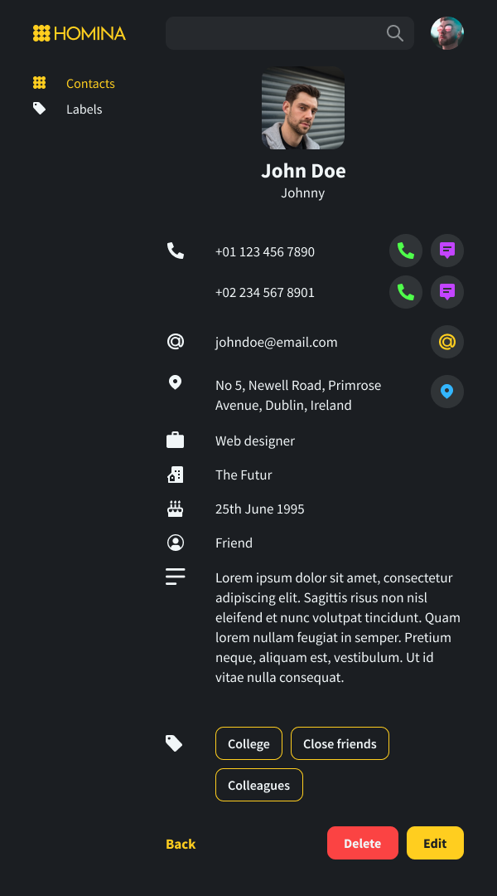

Tablet contact details UI

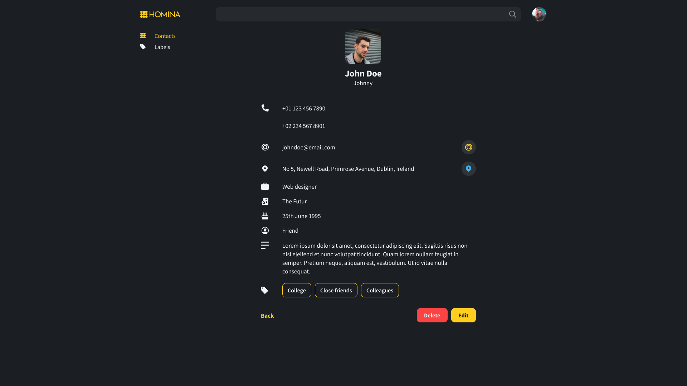

Web contact details UI

### Add Contact

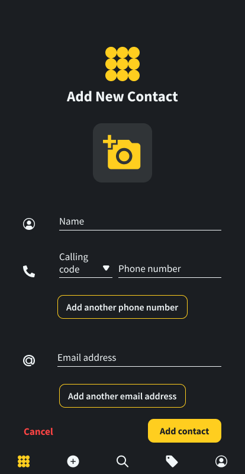

Mobile add contact UI

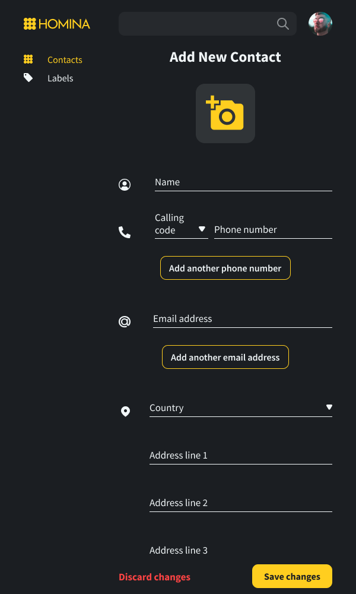

Tablet add contact UI

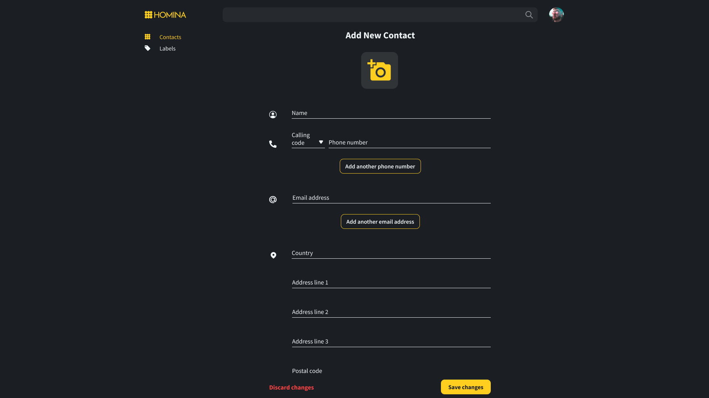

Web add contact UI

### Edit Contact

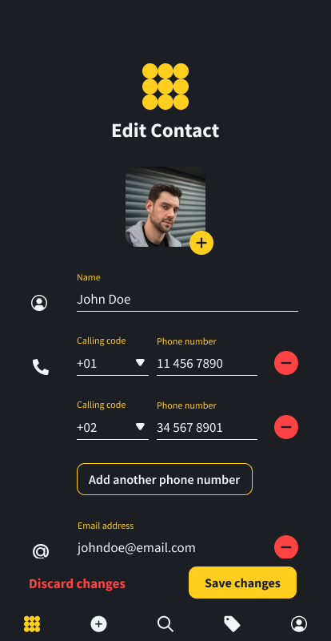

Mobile edit contact UI

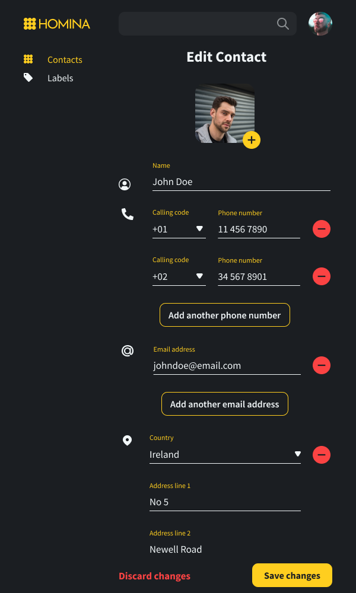

Tablet edit contact UI

Web edit contact UI

## System Architecture

### System Overview

Homina is a cross-platform application that stores, syncs and backs up users' contacts on the cloud. It consists of a front end written in React (web) and React Native (mobile), a web server written in Node.js and Express, a Redis cache for session storage, and a PostgreSQL database for contacts storage. The back end (server and database) is hosted on Heroku while the front end (web and mobile clients) is hosted on and distributed via Netlify.

### Front End Architecture

### Server Architecture

### Data Storage